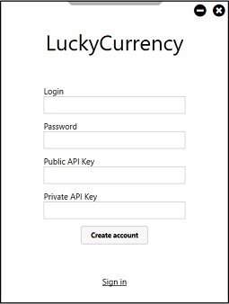
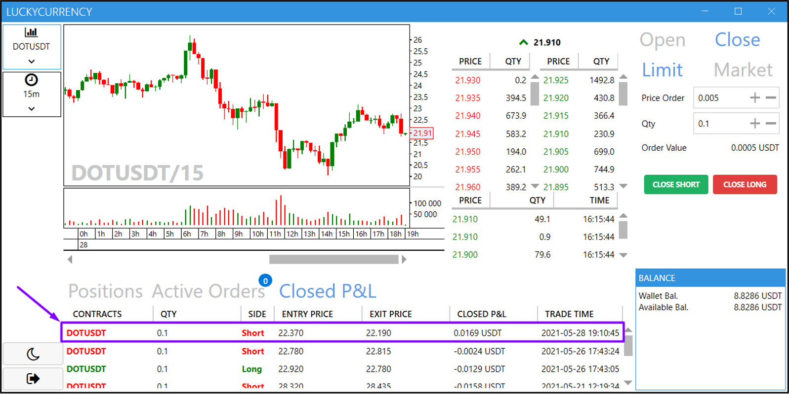

# LuckyCurrency
Торговая платформа (биржа [Bybit](bybit.com)), где использовалась аутентификация на основе
HMAC для подтверждения транзакций, общение с биржей производилось посредством HTTP и WebSocket

Entity, MVVM, WPF

## Руководство по использованию
После запуска приложения открывается окно авторизации, если у вас нет аккаунта, можно зарегистрировать нового пользователя

В форме регистрации необходимо ввести API-ключ, предоставленный биржей Bybit. Таким образом, после регистрации, вы закрепите за своим аккаунтом API-ключ и теперь для входа вам нужно знать только логин и пароль, а API-ключ будет подтягиваться из базы данных.

После успешного входа откроется главное окно. Оно содержит боковое меню, свечной график, книгу ордеров, список последних сделок на бирже, список открытых позиций, список активных ордеров, список закрытых позиций, текущий баланс и панель для торговли

Есть возможность открыть/закрыть позицию лимитным или рыночным ордером. При создании лимитного ордера, он будет помещен в книгу ордеров и мы будем ожидать исполнения нашего ордера, таким образом мы будем являться «мейкером». Мейкеров биржа поощряет отрицательной комиссией (-0,025%), так как они создают плотность книги ордеров. Пример создания лимитного ордера на покупку приведен ниже

Если же мы хотим выставить ордер, который сразу же будет исполнен, то наш выбор – рыночный ордер. В данной ситуации мы будем являться «тейкером». Тейкер, это тот, кто покупает или продает по рынку, он удовлетворяет ближайшие ордера в книге ордеров. Биржа будет взымать с нас комиссию (0,075%). Пример создания рыночного ордера на продажу представлен ниже

После закрытия позиции (открытой рыночным ордером выше), мы можем посмотреть информацию о ней во вкладке «Closed P&L»

