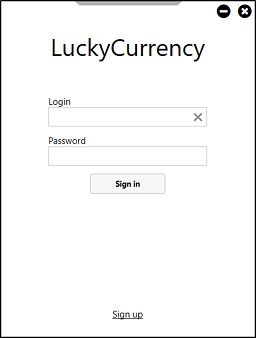

# LuckyCurrency
Торговая платформа, где использовалась аутентификация на основе
HMAC для подтверждения транзакций, общение с биржей производилось посредством HTTP и WebSocket

Entity, MVVM, WPF

## Руководство по использованию
После запуска приложения открывается окно авторизации (рисунок 1), если у вас нет аккаунта, можно зарегистрировать нового пользователя (рисунок 2). В форме регистрации необходимо ввести API-ключ, предоставленный биржей Bybit. Таким образом, после регистрации, вы закрепите за своим аккаунтом API-ключ и теперь для входа вам нужно знать только логин и пароль, а API-ключ будет подтягиваться из базы данных.

